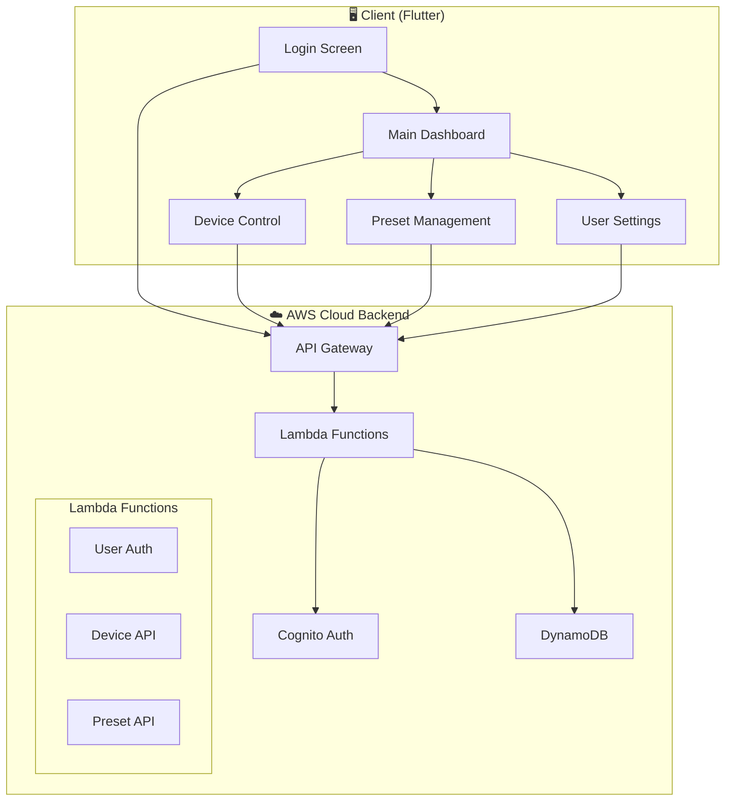

# 🚀 快速启动指南 (Quick Start Guide)

## 🎯 5分钟快速体验

### 1. 克隆项目
```bash
git clone <your-repo-url>
cd AM_demo
```

### 2. 启动前端应用 (无需后端配置)
```bash
cd audio_device_manager
flutter pub get
flutter run -d chrome  # 在浏览器中运行
```

### 3. 使用测试账户登录
```
管理员: admin@demo.com / AdminPass123!
用户: user1@demo.com / UserPass123!
```

## 📊 项目架构图



## 🔗 相关链接

- 📱 [前端应用文档](./audio_device_manager/README.md)
- 🔧 [后端API文档](./audio_device_backend/README.md)
- 📖 [完整API参考](./audio_device_backend/API_DOCUMENTATION.md)
- ⚡ [API快速参考](./audio_device_backend/API_QUICK_REFERENCE.md)